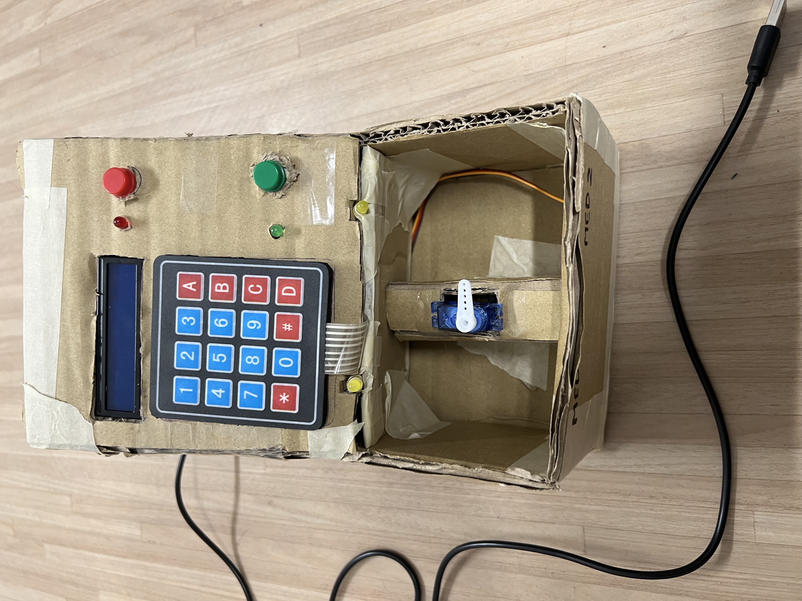
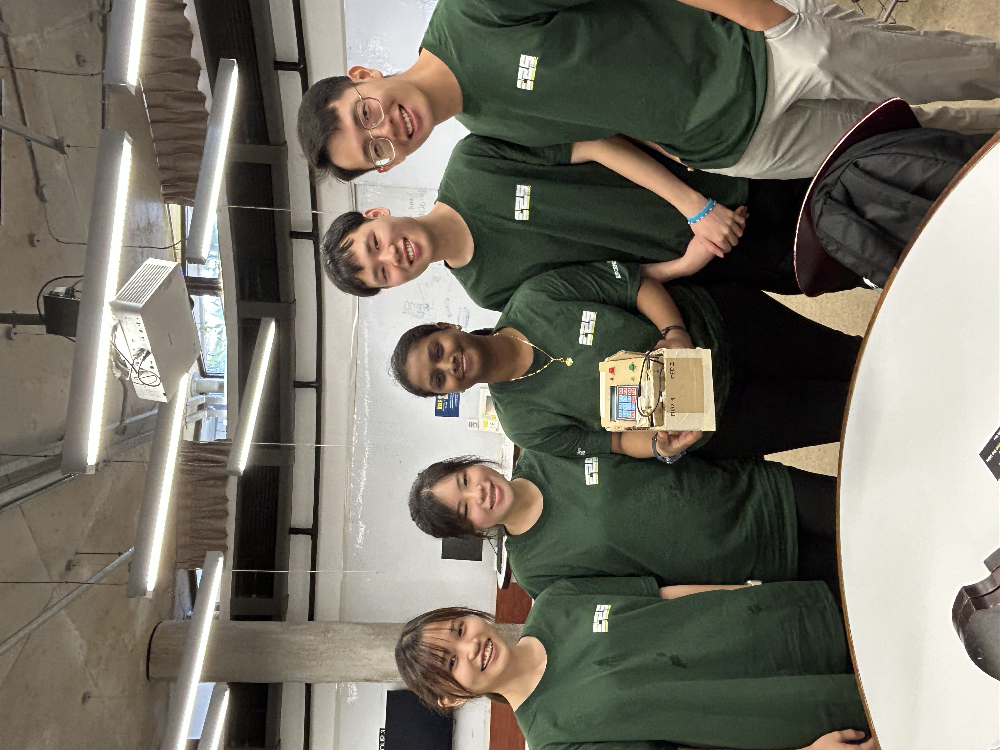

# NTU Escendo 2025 🛠️

## About the Competition
**Escendo 2025** is the flagship make-a-thon organized by **Garage @ EEE**. With the theme **"Optimising the Future: Lean Solutions"**, this year's event emphasized developing creative and innovative solutions using the **lean methodology** to optimize processes.

- **Competition Dates**: 8 - 11 January 2025
- **Theme**: Optimising the Future: Lean Solutions
- **Objective**: To develop innovative solutions that integrate the principles of lean methodology for optimizing processes and improving efficiency.

---

## Our Project: **MediMinder** 💊

### Project Overview
**MediMinder** is a smart medication storage and reminder system designed to improve adherence to medication schedules. The system provides user-friendly operations, personalized timer configurations, and secure storage to ensure users stay on track with their prescribed medication regimen.

---

### Key Features and Highlights
1. **System Design & Prototyping**:
   - Conceptualized and prototyped an intelligent medication storage system.
   - Features **personalized timer configurations** for tailored reminders.
   - Emphasis on **user-friendly operations** for an improved user experience.

2. **Circuit Design & Implementation**:
   - Designed and implemented an electronic circuit integrating:
     - A **microcontroller** for system control.
     - Sensors and components to ensure reliable functionality.
   - Focused on creating a robust and scalable solution.

---

### Lean Methodology in Action
During the project, we followed the lean methodology to:
- Minimize waste in the design and prototyping process.
- Rapidly iterate and validate key components of the system.
- Deliver a solution that balances functionality, cost-effectiveness, and usability.

---

### Conclusion
Participating in **NTU Escendo 2025** allowed us to challenge ourselves to create an impactful solution for a common healthcare issue. **MediMinder** embodies the spirit of the competition by optimizing processes and improving lives through lean and innovative design.

---
